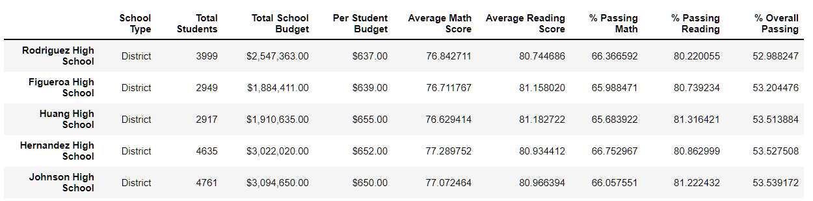
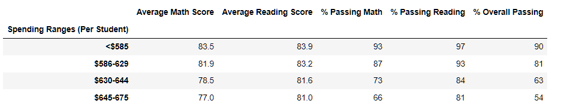

# School District Analysis

## Overview of the School District Analysis Project
The purpose of the School District Analysis project is to develop student and school performance analyses on reading and math scores, and to evaluate performance based on school size and budget level by high school and per student. Deliverables for the project include:
- High level snapshot of the district's key metrics
- Overview of the key metrics for each school
- Tables include
  - Top 5 and bottom 5 performing schools based on overall passing rates
  - Average math and reading scores by students in each grade level at each high school
  - School performance based on budget per student
  - School performance based on school size
  - School performance based on type of school

During development of the analysis, the district manager was informed by the school board of possible academic dishonesty from one of the high schools in the district. To uphold state-testing standards, the student scores in question were converted to null values (NaN - not a number), which required recompiling the anaylsis. As part of the project, the data deliverables were adjusted, and comparisons between the two results provided to determine how the changes affect the overall analysis.

## Resources
Resources include
- Clean data CSV files for analysis located <a href="https://github.com/TeresaWehmeier/School_District_Analysis/tree/main/Resources" target="_blank">in the resources folder.</a>
- Jupyter notebook
- Pandas libraries

## Results
### Impact on Thomas High School
Before digging into the high level reports, it is important to remove test score results to address the academic dishonesty concerns. This process is performed using the .loc method, and identifies the specific high school and grade levels in question. Both the math and reading scores are set to NaN using this code:

```
        student_data_df.loc[(student_data_df['school_name']=='Thomas High School')
        & (student_data_df['grade']=='9th'),['subject_score']]= np.nan
```
 - To verifiy the scores are removed, a sum of "isnull()" is performed with the results shown here:

    
    
The next step is to re-establish the average scores for both math and reading by high school, and recompile the summary by high school report. Overall passing rates for Thomas High School decline from 90.9% to 90.6%, or less than half a percent, as a result of the modifications made to the school test results. Average math scores for the same high school decline from 83.4 to 83.35, or less than .05 of a point, while average reading scores _increase_ from 83.8 to 83.9.

Based on the high school summary report, overall percentage passing rates and average math and reading scores, revisions to Thomas High School show a minimal impact to their overall results. The revised high school summary report is pictured here:


### Impact on Comparative Results
The top five and bottom five performing schools were identified in the original analysis, and Thomas High School remains in the top five, even after modifications to the test scores. In fact, the high school's position remained at second position, and has no affect on the other top five performers.

1. Original Top Five Performance Results

  

2. Revised top Five Performance Results

  

3. Bottom Five Performance Results (no change after revision)



4. Average math and reading scores by grade level and high school were also compiled, with the only change in the new analysis that of the 9th grade results for Thomas High School set to NaN. Both math and reading were compiled, with only math shown here.


### High Level Summaries
#### Performance Based on Budget Per Student
Spending ranges were developed to determine math, reading and overall performance based on budget per student. In the initial report, the spending per student bins are defined as <$585, $585-629, $630-644, and $645-675. These results are based on descriptive statistics, with some minor adjustment to more evenly balance the high school distribution in the bins. Once the changes are made, and the spending ranges per student are recompiled, there is no difference in performance based on spending per student. Thomas High School falls into the $630-644 spending bin, where none of the metrics are impacted by the data changes. 

1. Spending Ranges Per Student Report - Recompiled (no change)



#### Performance Based on School Size
School size is used to determine performance impact based on the size of the school. The range was set at Small (<1000), Medium (1000-2000) and Large (2000-5000). There is no impact on the overall report by school size after data changes are applied. Below is the revised report.

1. Performance based on School Size Report - Recompiled (no change)


#### Performance Based on School Type
There are two types of high schools in the district: charter and district. Anlysis comparing performance between the two is compiled to show any variance. There is no change in results after recompiling the report. Thomas High School is a charter school. Average math, reading and percentage of overall passing results do not change after recompiling. New report is provided.

1. Performance based on type of school - Recompiled (no change)


#### Overall District Performance
The district summary includes performance metrics for all fifteen high schools in the district. After recompiling the data there is a variance in performance before and after changes are made to the data. However, these changes are only apparent when the data is analyzed with a decimal in the percentages. When comparing the old report to the new report at a tenth of a percent, there is clear, though nominal, difference in the percent passing math, percent passing reading and the overall percent passing results. Percent passing math declines by .20%, percent passing reading declines by .10% and the overall passing rate declines by .30%. 

1. District summary prior to data changes


2. District summary after data changes


## Summary


                                                                 

